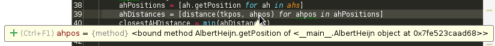
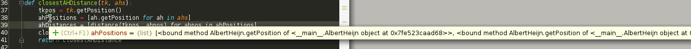
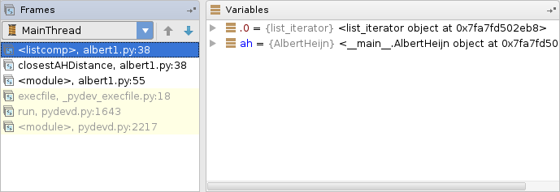

## Topic 2: Object orientation, PyCharm and debugging


### Introduction

This tutorial goes into some more detail about working with Python, in particular using the IDE PyCharm.

#### Assignment submissions

For this topic, you have to submit answers for assignments 2 (`smartShop.py`) and 3 (`albert2.py`), together with the answer to
assignment 1 from week 1.

### Table of Contents

-   [Classes and Objects in Python](#classes-and-objects-in-python)
    -   [Object Orientation Basics](#object-orientation-basics)
    -   [Defining Classes](#defining-classes)
    -   [Making and Using Objects](#making-and-using-objects)
    -   [Static vs Instance Variables](#static-vs-instance-variables)
-	[Assignment 2](#assignment-2-for-submission)
-   [Using PyCharm for Debugging](#using-pycharm-for-debugging)
    -   [Clicking the stacktrace](#clicking-the-stacktrace)
    -   [Finding definitions by Ctrl-click](#finding-definitions-by-ctrl-click)
    -   [Using Google effectively](#using-google-effectively)
    -   [Using `print` statements](#using-print-statements)
    -   [Using PyCharm's Debug mode](#using-pycharms-debug-mode)
        -   [Getting ready](#getting-ready)
        -   [The Debug interface](#the-debug-interface)
        -   [Mouse-over](#mouse-over)
        -   [Breakpoints](#breakpoints)
        -   [Stepping](#stepping)
        -   [End boss](#end-boss)
-	[Assignment 3](#assignment-3-for-submission)

### Classes and Objects in Python

You already have some experience with so called "object-oriented (OO) languages" such as C++, Java and Schema.
Python is object-oriented too, and as such it has some specific language features to work with classes and objects.

The PacMan projects will not require extensive use of those object-oriented features, but you will need to use objects to some extent, and so it's worth covering the basics of objects in Python.
Because this is not a course in object-oriented programming, we will only give a limited overview.

#### Object Orientation Basics

The essence of an object-oriented program is that its architecture revolves around its data structures instead of around its functionality. An object-oriented program consists of a number of interacting data structures called objects. The functionality of the program is encapsulated within those objects, instead of being "on the loose" in the program.
 Objects not only contain data, but also functions to interact with and manipulate those data: that makes them active, self-contained, independent (but cooperating) entities playing some role within the program.

An object does not just contain its data and functions, it **encapsulates** them: they can only be accessed from outside the object in as far as the object allows it.
 Direct access to object data is strongly discouraged in most OO languages: the object always has to be **asked**. A well-constructed object has special functions for that purpose, often called "getters" (for reading data) and "setters" (for changing data).
 Object functions may or may not be accessible from outside the object. Those functions that are, are said to be part of the "message set" for the object, they are "public". But other functions may be intended for use by the object itself only: they are "private".

By encapsulating related data in objects, together with the relevant functions, inappropriate use is (largely) avoided, and related actions are kept together: only the object is made responsible for guarding, using and updating its data.

The actual objects in a running OO program are instances of their respective *class*. In principle, there can be an unlimited number of instances of the same class (just as there can be an unlimited number of variables of the same type, e.g. integer).
 The class (or rather: the class definition) contains the description for the object instances of that class. The class definition also states (expicitly ot implicitly) which data elements and functions are accessible from outside the object (i.e. are "public").
 A class may be declared to be a sub-class (or "daughter") of another (existing) class. If so, the sub-class will *inherit* all data and functions from the "mother" or super-class: that is, in as far as the sub-class does not contain any definition of itself, it is a copy of the super-class class. Where the sub-class does contain definitions, they overrule or add to those of the super-class.

#### Defining Classes

In the file `shop.py`, you can find an example of a class definition, defining a class named `FruitShop`. The `FruitShop` class has some member variables, the name of the shop and the prices per pound of some fruit, and it provides functions, or methods, on this data.

Note the following:

* All functions *and member variables* are public in the class definition below. In Python, there is a convention that a name starting (but not ending) with `__` (two underscores) means that the function or variable is supposed to be private; all other functions and variables are public.
* The "getter" functions for providing access to the object data, even though they are public. It's considered good Python practice *not* to directly access object data (even if you can), but to use getters / setters. The function `getName(self)` does nothing else but return the value of `self.name`, the other functions do a little bit more than just "getting".
* Every reference to a member variable starts with `self.`, referring to the object itself: you have to indicate explicitly that the variable is part of the object.
* Every function has `self` as its first parameter. This parameter is obligatory (and must be the first) for object methods.
* he first method `__init__(self, name, fruitPrices)`. This is a so called "constructor" which is invoked every time that an object of this class is instantiated (and only then). One of the things it does is initializing member variables with values provided as parameters to the constructor function.

#### Making and Using Objects

So how do we make an object and use it? An example can be found in `shopTest.py`. The statement `import shop` makes the `FruitShop` class available (since `shop.py` is the name of the file) and `FruitShop` objects can then be created. Running the file `shopTest.py` produces the following output.

```
Welcome to the Aldi fruit shop
1.0
Apples cost €1.00 at Aldi.
Welcome to the Albert Heijn fruit shop
4.5
Apples cost €4.50 at Albert Heijn.
My, that's expensive!
```

So what just happened?
* The `import shop` statement told Python to load all of the functions and classes in `shop.py`.
* The statement `aldiShop = shop.FruitShop(aldiName, aldiPrices)` constructs an *instance* of the `FruitShop` class defined in `shop.py`, by calling the constructor function `__init__` in that class.
* Note that we only passed two arguments to the constructor, while `__init__` seems to take three arguments: `(self, name, fruitPrices)`. The reason for this is that all methods in a class have `self` as the first argument. The value of the variable `self` is automatically set to the object itself; when calling a method, you only supply the remaining arguments. The `self` variable contains all the data (`name` and `fruitPrices`) for the current specific instance (similar to `this` in Java).
* Also note that when we call a method of an object, we have to precede the function name by the object name and a dot: not `getCostPerPound('apples')` but `aldiShop.getCostPerPound('apples')`.
* The print statements uses the substitution operator (described in the [Python docs](https://docs.python.org/3/library/stdtypes.html#textseq) if you're curious).

**Exercise 1:** Given a script file containing the following code.

```py
shopNames = ['Aldi', 'Albert Heijn']
shopPrices = [{'apples': 1.00, 'oranges': 1.50, 'pears': 1.75}, {'kiwis':6.00, 'apples': 4.50, 'peaches': 8.75}]
```

Extend the script using a `for` loop so that is produces the same output as `shopTest.py`.

#### Static vs Instance Variables

The variables in the `Fruitshop` class above are all *instance variables*. Every instance (object) of the Fruithop class has its own copies of the variables `fruitPrices` and `name` with their own values.
 In contrast, *static variables* are shared by all instances of a class. If the value of a static variable changes, it changes for all instances (objects) of that class.
 Variables that are first mentioned *within* the `__init__` definition are instance variables, a variable that is first mentioned *before* the `__init__` definition is static.

The following example illustrates how to static and instance variables work in Python. Take a look at the definition of the class `Person` in the file `person.py`. The class could be used as follows in the interactive interpreter:

```py
>>> import person
>>> p1 = person_class.Person(12)
>>> p1.get_population()
1
>>> p2 = person_class.Person(63)
>>> p1.get_population()
2
>>> p2.get_population()
2
>>> p1.get_age()
12
>>> p2.get_age()
63
```

In the code above, `age` is an instance variable and `population` is a static variable. The variable `population` is shared by all instances of the `Person` class whereas each instance has its own `age` variable.

### Assignment 2 (for submission)

Use your solution to assignment 1 from last topic to complete the function `getPriceOfOrder` in `shop.py`. Then complete the function `shopSmart(orders,shops)` in `shopSmart.py`, which takes an `orderList` (like the kind passed to `FruitShop.getPriceOfOrder`) and a list of `FruitShop`s and returns the `FruitShop` where your order costs the least amount in total.

The following variable definitions

```python
fruits1 = {'apples': 2.0, 'oranges':1.0}
fruits2 = {'apples': 1.0, 'oranges': 5.0}
shop1 =  shop.FruitShop('shop1',fruits1)
shop2 = shop.FruitShop('shop2',fruits2)
shops = [shop1, shop2]
orders1 = [('apples',1.0), ('oranges',3.0)]
orders2 = [('apples',3.0)]
```

should result in the following being true

```py
shopSmart(orders1, shops).getName() == 'shop1'
shopSmart(orders2, shops).getName() == 'shop2'
```

You can test your code by creating a new file and importing `shopSmart`. You can then call the function using `shopSmart.shopSmart(order,shops)`.

### Using PyCharm for Debugging

Over the coming weeks, it will sometimes be difficult to locate the causes of problems in your code. Especially so since the Pacman program is large and complex, and the error messages provided by Python can occasionally be hard to interpret.
 To help you find out what's wrong in case you get an error message (which will undoubtedly happen), we'll discuss some PyCharm techniques that can make the process a lot easier. The bulk of the discussion will be about debug mode, but the other topics should be useful too.

We'll be using the code in the file `albert1.py` to learn about these powerful techniques. As you can tell, this code defines a class and some functions, then uses these to create a list of Albert Heijns and calculate the distance to the closest Albert Heijn from the TK. Before moving on, please make sure that you understand how the code does this.
 The code presented here is logically correct - it will find the distance to the closest Albert Heijn. But there's a mistake in the code. By running this file in PyCharm (try it!), we encounter the following error message or 'stacktrace':

```
Traceback (most recent call last):
  File "filename.py", line 55, in <module>
    print(closestAHDistance(tk, albertheijns))
  File "filename.py", line 39, in closestAHDistance
    ahDistances = [distance(tkpos, ahpos) for ahpos in ahPositions]
  File "filename.py", line 39, in <listcomp>
    ahDistances = [distance(tkpos, ahpos) for ahpos in ahPositions]
  File "filename.py", line 31, in distance
    return math.sqrt(pow(xy1[0] - xy2[0], 2) + pow(xy1[1] - xy2[1], 2))
TypeError: 'method' object is not subscriptable
```

We're going to try and figure out what is causing this error.

#### Clicking the stacktrace

The first thing you should know is that the links in stacktraces (likely colored purple in PyCharm) can be clicked, and they will take you to the location in the code that is mentioned by that line of the stacktrace.
 For example, we can click the last link and see that it takes us to the last line of the following method:

```py
# Returns the distance between points 'xy1' and 'xy2'
def distance(xy1, xy2):
    return math.sqrt(pow(xy1[0] - xy2[0], 2) + pow(xy1[1] - xy2[1], 2))
```

According to the stacktrace, this line is producing the error "TypeError: 'method' object is not subscriptable".
 What on earth does that mean? We'll examine it later. First of all, what if we don't know what `math.sqrt` does? There's an easy way to find out.

#### Finding definitions by Ctrl-click

By holding the Ctrl (or Cmd on Mac) key and clicking on any variable or method call in the code, PyCharm will attempt to show you the definition of that variable or method. For example, if we ctrl-click on `xy1` in the 'return' statement, PyCharm will show us that it is defined as a parameter of the `distance` method. And if we ctrl-click on the `math.sqrt` call, PyCharm will show us the definition of that method.
 The function `math.sqrt` is a bit special though: it's built-in, so PyCharm can only show us the documentation for it, not the actual code. But that can already help: we can read "Return the square root of x.".
 If you're still not sure at this point what a function does, well, use Google. But be sure to remember that ctrl-clicking will also work for methods that are used inside the Pacman projects. This will be very useful later on, when you are trying to figure out what the pre-made functions you are using actually do. Exploring like this can also help you discover functions that are defined near the functions that you already know of, which may be very useful discoveries.

#### Using Google effectively

At the risk of stating the obvious, Google is one of your your best resources when you're stuck (and there are no teachers or assistants around).
 However it does take some practice to become familiar enough with a certain area of expertise before you can effectively use Google to solve problems in that area. That is to say, you have to know what to look for...

Let's see what Google can tell us about the error we got in our code. Most likely, all words in the error message are familiar to you, except "subscriptable". [Googling that](https://www.google.nl/search?q=subscriptable) should give you a bunch of results about Python right away. When we tried, the first hit was [a question on Stack Overflow](http://stackoverflow.com/questions/216972/in-python-what-does-it-mean-if-an-object-is-subscriptable-or-not), a very handy site for programming questions: "In Python, what does it mean if an object is subscriptable or not?"
 The top answer says:

> It basically means that the object implements the `__getitem__()` method. In other words, it describes objects that are "containers", meaning they contain other objects. This includes lists, tuples, and dictionaries.

Doesn't make much sense yet? Let's look at the next best answer:

> Off the top of my head, the following are the only built-ins that are subscriptable:
> ```
> string:  "foobar"[3] == "b"
> tuple:   (1,2,3,4)[3] == 4
> list:    [1,2,3,4][3] == 4
> dict:    {"a":1, "b":2, "c":3}["c"] == 3
> ```
> But mipadi's answer is correct; any class that implements `__getitem__` is subscriptable.

If we compare this information with the error message, we might understand that 'subscripting' is the method of getting an element from a list-like variable type, using the square bracket notation with an index (e.g. `[3]`).
 If we want to confirm this theory, we can try to Google what we now think are two related terms: 'subscript index'. The first hit should be the Wikipedia article on [Index Notation](http://en.wikipedia.org/wiki/Index_notation). On this page, we can do a search (Ctrl+F) for 'subscript' to find our confirmation:

> It is frequently helpful in mathematics to refer to the elements of an array using subscripts.

So indeed, subscripting has to do with the notation for getting an element from an array/list. Further down on the Wikipedia page, there's even a piece of example C code showing the square bracket notation itself.

#### Using print statements

Let's take another look at the full error.

```
TypeError: 'method' object is not subscriptable
```

Apparently some object is subscripted, which is illegal because the object is a 'method' object, whatever that means.
 If we look at the line of code where the error occurs

```py
return math.sqrt(pow(xy1[0] - xy2[0], 2) + pow(xy1[1] - xy2[1], 2))
```

we find that there are, indeed, several subscripts on this line (e.g. `xy1[0]`). Apparently one of these is being done on an object that does not actually allow subscripting. How do we find out which object is the culprit? And why?

We could place a `print` statement in the method, to show us what the variables are.

```py
def distance(xy1, xy2):
    print(xy1)
    print(xy2)
    return math.sqrt(pow(xy1[0] - xy2[0], 2) + pow(xy1[1] - xy2[1], 2))
```


Running the code now shows us this:

```
(75, 56)
<bound method AlbertHeijn.getPosition of <code.AlbertHeijn object at 0x7fb419af4f28>>
```

While that first line looks alright, the second is certainly not what a position is supposed to look like, so something's wrong. But what's going on? How did this strange object end up in the `distance` method? Print statements do not really help us much.
 Not only are print statements too weak for complex debugging, they can also be confusing and even dangerous.
 Imagine that we were dealing with something more complex than a simple position. A program that itself uses `print` statements as part of its regular output. We might need several debug `print` statements, that would be in between the program output. Confusing.
 Furthermore: in some cases the error might occur in pieces of code that we did not write ourselves. What if we make a mistake and mess up other peoples' code?

We need a better way of finding errors in our code - a way where we don't need to add things or change our code to find the error.

#### Using pyCharm's Debug mode

This is where pyCharm's debug mode comes in. Normally when you run a program, the computer just runs it, without thinking that you might want to know what's happening in the code (because most of the time, you don't).
 In debug mode, the computer keeps track of what is happening. It can show you what variables there are and what their current values are. You can pause the execution of the code when you would like to see what is going on at a particular point in your code. And you can get a lot more information about the way the computer is running your program.

Debug mode is a key feature of an Integrated Development Environment (IDE) like PyCharm. It's one of the reasons we use IDE's instead of editing our code in Notepad or some such. And if you learn how to use debug mode in one IDE, you'll pretty much know how to do it in any one.

##### Getting ready

To use debug mode, first make sure that you have set a 'run-configuration' in PyCharm. This just means that you have taken the steps so that you can click the green arrow in the top right to run your code.


If the arrow in the top-right is not green, you can set a run-configuration by right-clicking on the open file in the project manager to the left, and selecting `Run 'albert1.py'...`


If your project files are not in the list to the left, you can load them using the menu-option `File -> Open Directory...`

Once you can run your Python file using the arrow to the top-right, you can use debug mode. You can launch debug mode by clicking the 'bug' icon right next to the green arrow. When a program is started in debug mode, it may be a bit slower, especially at the start, so be patient.
 When an error is encountered in debug mode, the program will 'break', which means it will pause and show you where the error occurred.

##### The Debug interface

If you place run the file 'albert1.py` in PyCharm in debug mode, you should eventually see something like this:


If you don't see any line numbers, right-click the area where they should be. There will be a popup window with options where you can enable line numbers.

The icon  on line 31 indicates that an error occurred on this line, and debug mode placed a 'breakpoint' here, halting the execution, so that you can have a look at what's going on, and what the current state of all the variables is.

At the bottom of the screen, some new windows have appeared. Two of them are of special interest for now: the 'Frames' window to the left, and the 'Variables' window in the middle.
 The Variables window lists the variables that exist at the current execution state. As you can see, it lists `xy1` and `xy2`. `xy1` is a tuple, representing a position, just as expected. However `xy2` is a *method*.
 So far, we get the same information as we saw when we printed these variables. Now, however, we can trace back where this strange variable came from, using the Frames window.
 The Frames window shows the path of methods through which the code reached the `distance` method. As you can see, it starts at the bottom with a `run` method, going through `closestAHDistance` and `<listcomp>` on its way to `distance`. Each method in the list contains a line on which it calls the method above it. We can click on a method in the list to see it, and also see the variables that exist in the method.
 Let's click on the method `<listcomp>` below `distance`.


You need to know that `<listcomp>` is a method that does 'list comprehension': the kind of stuff like `x for y in z`. This is exactly what we see on line 39. We also see that `distance` is called on that line: this makes perfect sense, since that was the previous level in the Frames list.

##### Mouse-over

In the Variables window, we now see the variables that exist in the list comprehension. Instead of reading the Variables window, we can also mouse-over the variables in the code, and get the same information. For example for the variable `ahpos` in the list comprehension, we again see that there is a method here:



Let's go one level higher in the Frames window, to `closestAHDistance`, to see what variables exist there. We can now mouse-over `ahPositions` and see that that variable is a list with the strange method object in it.



It seems certain that something is going wrong while creating the `ahPositions` variable. Why is there a 'method object' in it instead of a tuple of integers? We need to take a look at how the list is being created. However, the list already exists at the time that the program has halted. So how can we look at what's happening during its creation?

#####  Breakpoints

We saw that debug mode placed a breakpoint for us on line 31, in the `distance` method. We can also place our own breakpoints to tell debug mode to halt the program and let us take a look at what's happening. We can place a breaqkpoint on a line in the code, and the program will halt when it reaches that line.

Let's say we want to take a look at everything that is happening in the `closestAHDistance` method. Let's start by placing a breakpoint on the first line of the function body, so that we can see what's happening there.
 You can place a breakpoint by clicking just to the right of the number of the line where you want the break to occur. A red ball icon will appear and the line will become red. A breakpoint only has effect in debug mode: if you run the program using the normal green arrow, it will ignore the breakpoint.

 Let's place a breakpoint on line 37. Click on the location where the red ball is in this image:


Let's run the program in debug mode (the bug icon) after placing the breakpoint. This should produce the following:


The program has started executing, but it stopped when it encountered the breakpoint. We can now see the variables that exist at this point, just as before. We can mouse-over the variables that have been created so far in the method, and also the parameters to the method.

##### Stepping

Everything looks in order, there are no strange 'method objects' at this point yet. How do we proceed now? Do we remove the breakpoint and place a new one on the next line, then run debug mode again? That would be very tiresome.
 Luckily, there are tools to tell the program to advance through the code slowly. These are located just above the Frames and Variables windows.


You can mouse-over these icons to see what they do:

*   Step over: From the current execution point, run to the next line in the file, and stop there.
*   Step into: Enter the first method that is being called on the current line (this can bring you to another method or file), and stop there.
*   Step out: Run to the end of the method and go out to the method that called this method, then stop there.

Let's try clicking 'Step into' right now.


This has brought us inside the method `getPosition` in the class `TerminalKamer`, which is the method that is called on the line we were just looking at, at the start of `closestAHDistance`.
 Let's click 'Step out' to finish this method call and go back to `closestAHDistance`. Now, take a look at the Variables window. There should be two items: `ahs` and `tk`.
 If you click 'Step over' now, the code will go to the next line in this method. That means that `tkpos` will then exist in the Variables window. Try it!
 We are now on line 38, where the culprit of our problem, the `ahPositions` list, is created.

##### End boss

Now that we have arrived at the place where we know something is going wrong in our code, we will start clicking 'Step into' again, so that we can see exactly what is going on. Start by clicking it once.


According to the Frames window, we are now inside a list comprehension function. This must be the list comprehension that is happening on line 38. In our Variables window, we see only a `list_iterator` - this is an internal variable used in the list comprehension.
 But another 'Step into' shows us that a new variable has been created: `ah`, which seems to be a normal looking `AlbertHeijn`:



More 'Step intos' will show more AlbertHeijns being processed by the list comprehension. After a couple more clicks, we might be surprised to find that the view changes to this:


We have exited the list comprehension function without finding anything strange. However, there does not yet seem to be a `ahPositions` variable.
 However when we do yet another 'Step into', it appears. And it contains the 'method object'... Where did it come from? Although we don't know the answer yet, we are now sure that it appeared during the list comprehension, thanks to debug mode.

When we're done looking, we can exit debug mode with the  button to the left. The unfinished program will terminate.

We might now want to restart debug mode to start the process over, because who knows, maybe we missed something. This means we have to hit the debug button again.

When we run through the same code again using debug mode, we might mouse-over the right part of `ah.getPosition` while we are in `<listcomp>`. This shows us, again, that this is a 'method object'. What this means is that we are making a list of methods, instead of a list of tuples. Why? Because a method call needs brackets `()` behind it in order to evaluate itself - otherwise, it's just a 'method object': we get a list of the methods instead of a list of their results. But you may have figured that out already.

So the fix is to change the incorrect method call

```
ahPositions = [ah.getPosition for ah in ahs]
```

to

```
ahPositions = [ah.getPosition() for ah in ahs]
```

Now, our code runs just fine. The output should be 5.385164807134504 (the closest AH is about 5.39 units from the TK).

### Assignment 3 (for submission)

The file `albert2.py` contains a different piece of code with an error. Running the code as-is results in a stacktrace. It is up to you to use the debugging features discussed above to find the error in the code and fix it, so that the desired result is given. You should upload the corrected `albert2.py` file as the solution to this assignment.

The program presented in the file also uses the Albert Heijn class, but for a different purpose. Namely, it tries to find the path along all of the Albert Heijns with the minimum total distance. The start of the path can be any of the Albert Heijns.

The program does this in a very naive way. First it generates all possible paths that pass by all of the Albert Heijns. It then calculates the total distance for each path and takes the path with the minimum total distance. Finally it prints the names of the Albert Heijns on this path in order.

For the five central Albert Heijns in Nijmegen, using Euclidean (straight line) distance, the output should be:

```
1 Daalseweg
2 van Schevichavenstraat
3 Stationsplein
4 Groenestraat
5 St. Jacobslaan
```

However, as said above, the code has an error. You should fix to code, so that the desired result is produced. The fix can be anything you like, but should be fairly small (not a complete rewrite of the code), and the resulting code should work for any set of Albert Heijns.

Try to make use of the techniques discussed earlier in this assignment. At the very least, you should place a breakpoint at a line in the code, then use the debugger to step through the lines while looking at the values of variables at different points.

#### Final thoughts

We hope that the techniques described in this tutorial will be useful in the coming projects. Debug mode is a powerful tool, allowing you to much more easily spot problems and errors in your code.

There are a lot of features of debug mode that we haven't discussed, such as the ability to 'watch' variables and methods and change the values of variables on-the-fly. If you want to learn more about debugging techniques and how to use them in PyCharm, you could [look here](http://www.jetbrains.com/pycharm/webhelp/debugging.html)
